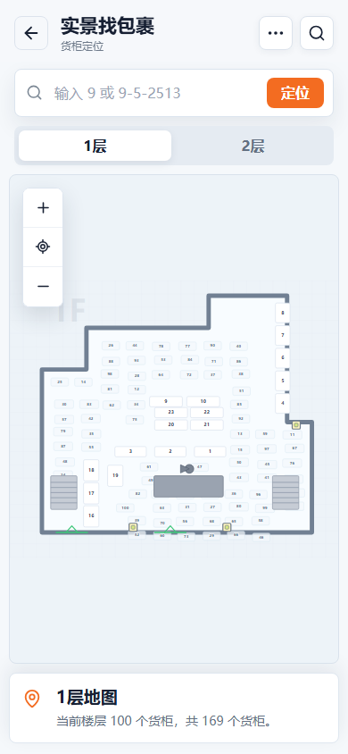
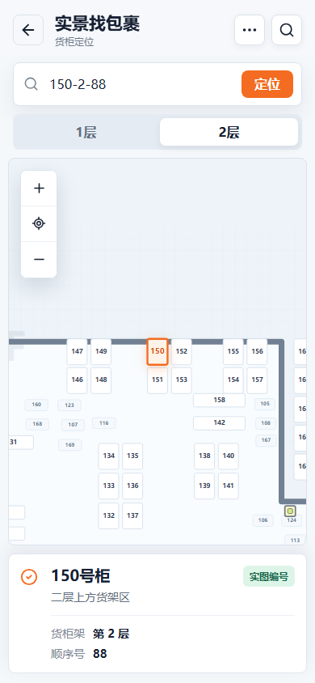

在我的学校，当我知道了快递货柜号，拿快递也不见得是一件很 easy 的事情。每次都要耗费一些时间在寻找货柜上，很多次拿快递累计下来，浪费的时间是巨多的。于是，我打算与快递站沟通，尝试我自己获取，或者他们那边给我货柜号分布的平面图。在我沟通之后，才发现淘宝已经有这个功能了。但是为了装逼，我还是得上传这个想法。

这个小东西的核心流程是：

线下搜集真实货柜位置  
-真实位置转换为结构化数据  
-用户输入货柜号  
-parsecode解析货柜号  
-findcabinet匹配货柜数据  
-根据货柜floor，x，y在地图绘制  
-svg高亮显示目标货柜  

重点难点：

真实数据 定义结构 输入解析 匹配数据 地图绘制与高亮

# 实景找包裹

一个类似小程序体验的快递站货柜定位前端。用户输入货柜号或取件码，例如 `9-5-2513`，页面会解析出货柜号、货柜架层数和顺序号，并在一层或二层平面图中高亮对应货柜。

## 项目背景

这个项目源于一次真实的校园取件体验。虽然淘宝已经提供了类似能力，但我仍然把这个想法完整做成了一个可以展示、可以运行、也可以继续改进的前端 Demo。

## 界面预览

一层地图：



搜索定位：



## 功能

- 输入货柜号或完整取件码后自动定位。
- 支持 `货柜号-货柜架-顺序号码` 格式，例如 `150-2-88`。
- 自动切换一层、二层地图。
- 支持地图拖动、缩放和结果高亮。
- 一共覆盖 `1-169` 号货柜。
- 图片中明确出现的货柜标记为实图编号，其余编号使用稳定补齐数据。

## 技术方案

- **Vite**：负责本地开发服务和静态资源打包。
- **React**：把搜索框、楼层切换、地图、结果卡片拆成组件。
- **TypeScript**：约束货柜数据、楼层、坐标和取件码解析结果。
- **SVG**：绘制室内平面图、墙体、楼梯、货柜和高亮状态。

## 取件码规则

取件码格式：

```text
货柜号-货柜架-顺序号码
```

示例：

```text
9-5-2513
```

解析结果：

- 货柜号：9
- 货柜架：5，表示从上到下第 5 层
- 顺序号码：2513

定位只依赖第一段货柜号，货柜架和顺序号用于结果展示。

## 数据说明

货柜数据在 [`src/data/cabinets.ts`](src/data/cabinets.ts)。

- `confirmed`：图片中明确出现的货柜编号。
- `inferred`：根据空余位置补齐的推测货柜编号。

推测补齐不是运行时随机，而是固定种子生成的稳定结果。同一个编号每次打开页面都会出现在同一个位置。

## 本地运行

```bash
npm install
npm run dev
```

默认访问：

```text
http://localhost:5173
```

也可以通过 URL 参数直接定位：

```text
http://localhost:5173/?q=9-5-2513
```

## 构建

```bash
npm run build
```

构建结果输出到 `dist/`。

## 部署到 GitHub Pages

仓库里已经准备了 GitHub Actions 配置：

```text
.github/workflows/deploy.yml
```

上传到 GitHub 后，在仓库设置里打开：

```text
Settings -> Pages -> Build and deployment -> Source -> GitHub Actions
```

之后推送到 `main` 分支时会自动构建并部署。
